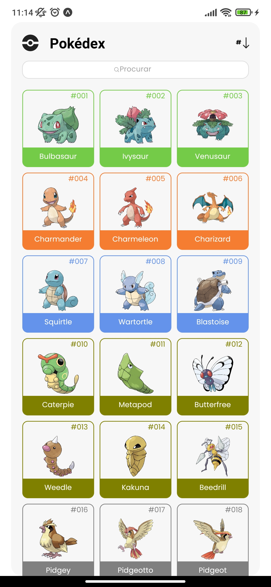
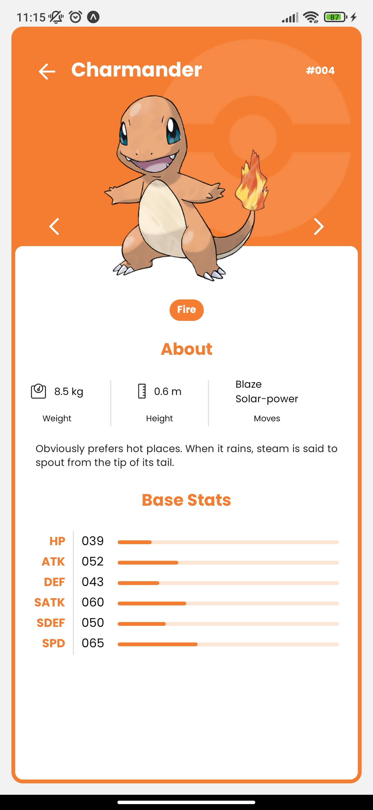
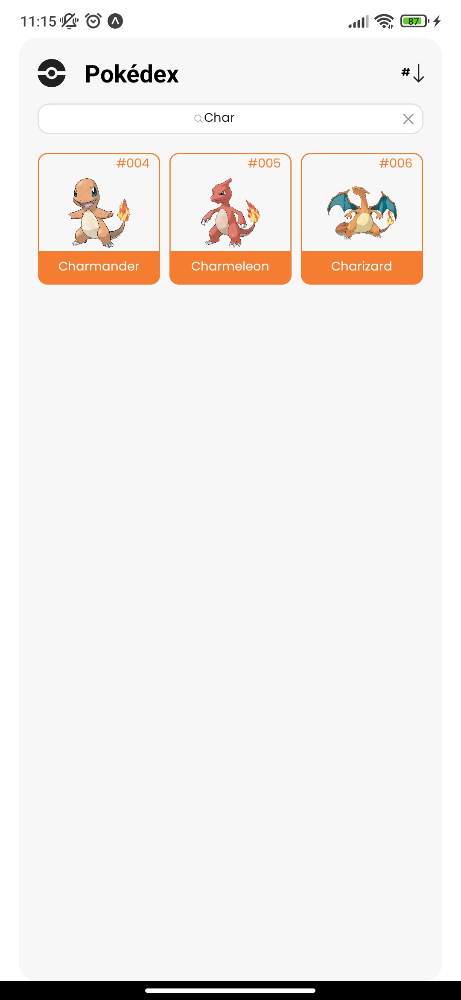

🔗 Pokédex

 
  
  
  

 

## Descrição

Este projeto é uma Pokédex desenvolvida em React Native com Expo, consumindo a api do pokemon. Ele foi criado como parte de um desafio para avaliar minhas habilidades e me tornar um possível contribuidor de um projeto.

A Pokédex permite que os usuários visualizem informações sobre diferentes Pokémon, como nome, tipo, habilidades e estatísticas. Além disso, eles podem pesquisar Pokémon específicos.

## Funcionalidades

- Lista de Pokémon: exibe uma lista de Pokémon com informações básicas, como nome e tipo.
- Detalhes do Pokémon: mostra informações detalhadas sobre um Pokémon específico, incluindo habilidades e estatísticas.
- Pesquisa de Pokémon: permite que os usuários pesquisem um Pokémon pelo seu nome.

## 📦 Pré-requisitos

Antes de executar o projeto, você precisa ter o seguinte instalado em sua máquina:
- node JS
- npm ou yarn
- Expo CLI

## 🛠️ Construído com

 
  
  
  

 

## Instalação

Siga as etapas abaixo para configurar e executar o projeto:

1. Clone este repositório: `https://github.com/GeovaneRigonato/desafio-pokemon-app.git`
2. Acesse o diretório do projeto: `cd pokedex`
3. Instale as dependências: `npm install` ou `yarn install`

## Executando o Projeto

Após concluir a instalação, você pode executar o projeto com o seguinte comando:

expo start

Isso iniciará o servidor do Expo e fornecerá um QR code que você pode escanear usando o aplicativo Expo Go em seu dispositivo móvel ou um emulador.

## ✒️ Autor

| [ Geovane Rigonato](https://github.com/GeovaaneRigonato) |
| :---: |

## Licença
Este projeto está licenciado sob a [MIT License](LICENSE).

Obrigado por ceder seu tempo lendo sobre meu trabalho!
